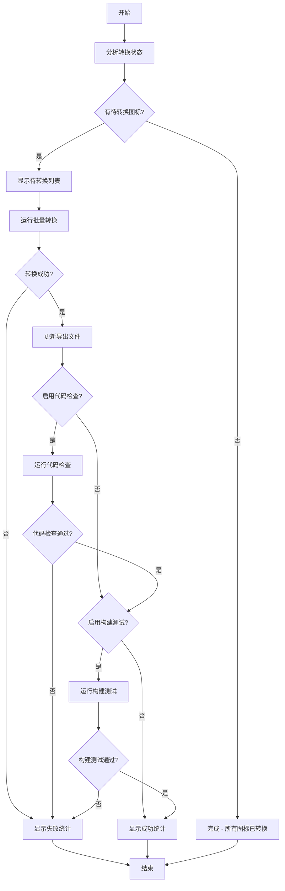

# React Native Icons 自动转换器

## 概述

`auto-converter.ts` 是一个综合的自动转换脚本，能够：

1. 🔍 **智能检测** - 自动对比 `/src` 和 `/packages/react-native/src/icons` 目录，识别未转换的 Web 图标
2. 🚀 **批量转换** - 调用 `batch-converter.ts` 完成图标转换
3. 📦 **更新导出** - 调用 `export-updater.ts` 更新主导出文件
4. 🔧 **代码检查** - 可选的运行 lint 检查验证代码质量
5. 🧪 **构建测试** - 可选的运行构建测试验证转换结果

这个脚本整合了现有的转换工具，提供一站式的转换解决方案。

## 使用方法

### 基本用法

```bash
# 转换所有未转换的图标
npx tsx auto-converter.ts

# 预览要转换的图标（不实际转换）
npx tsx auto-converter.ts --dry-run

# 转换前10个图标
npx tsx auto-converter.ts --max 10

# 转换后运行代码检查
npx tsx auto-converter.ts --lint

# 转换后运行构建测试
npx tsx auto-converter.ts --build-test

# 转换后运行代码检查和构建测试
npx tsx auto-converter.ts --lint --build-test

# 强制重新转换所有图标（包括已存在的）
npx tsx auto-converter.ts --force
```

### 命令行选项

| 选项           | 简写 | 说明                       |
| -------------- | ---- | -------------------------- |
| `--dry-run`    | `-n` | 预演模式，不实际执行转换   |
| `--lint`       | `-l` | 转换后运行代码检查         |
| `--build-test` | `-t` | 转换后运行构建测试         |
| `--force`      | `-f` | 强制更新，包括已存在的图标 |
| `--max <数量>` | `-m` | 限制转换的图标数量         |
| `--help`       | `-h` | 显示帮助信息               |

### 使用示例

```bash
# 1. 查看有多少图标需要转换
npx tsx auto-converter.ts --dry-run

# 2. 转换前5个图标进行测试
npx tsx auto-converter.ts --max 5

# 3. 转换所有图标并运行代码检查
npx tsx auto-converter.ts --lint

# 4. 转换所有图标并运行构建测试
npx tsx auto-converter.ts --build-test

# 5. 转换所有图标，运行代码检查和构建测试
npx tsx auto-converter.ts --lint --build-test

# 6. 强制重新转换指定数量的图标
npx tsx auto-converter.ts --force --max 20
```

## 工作流程



## 输出说明

脚本会显示详细的进度信息：

- 📊 **转换状态分析** - 总图标数、已转换数、待转换数
- 📝 **待转换列表** - 显示所有需要转换的图标名称
- 🚀 **转换进度** - 实时显示转换过程
- 📦 **导出更新** - 更新主导出文件状态
- 🔧 **代码检查** - 代码质量检查结果（如果启用）
- 🧪 **构建测试** - 构建测试结果（如果启用）
- 📊 **最终统计** - 成功 / 失败 / 跳过的详细数量

## 与其他工具的关系

```
auto-converter.ts (主脚本)
├── batch-converter.ts (批量转换)
├── export-updater.ts (导出更新)
├── test-runner.ts (测试运行器)
└── utils/file-converter.ts (文件转换器)
```

- **auto-converter.ts** - 主要的一站式脚本
- **batch-converter.ts** - 专门的批量转换工具
- **test-runner.ts** - 专门的测试运行器
- **export-updater.ts** - 专门的导出更新工具

## 错误处理

脚本包含完整的错误处理机制：

- ✅ 转换失败会显示具体的图标和错误信息
- ✅ 网络或文件系统错误会被捕获并显示
- ✅ 构建失败会中断流程并报告错误
- ✅ 提供详细的失败统计和建议

## 性能优化

- 🚀 智能跳过已转换的图标（除非使用 `--force`）
- 🚀 支持限制转换数量进行分批处理
- 🚀 预演模式快速预览转换计划
- 🚀 详细的进度显示和时间统计

## 注意事项

1. **权限** - 确保对项目目录有读写权限
2. **依赖** - 需要安装所有相关的 npm 依赖
3. **备份** - 建议在大规模转换前备份项目
4. **测试** - 使用 `--dry-run` 和 `--max` 选项进行小规模测试
